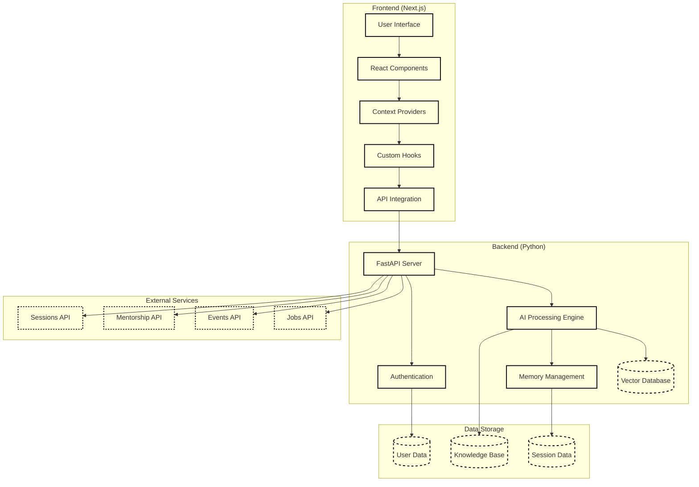

# OpportunityAI Project

## Overview

OpportunityAI is an AI-powered virtual assistant designed to enhance user engagement on the JobsForHer Foundation platform. It combines a Next.js frontend with a Python backend to provide seamless access to publicly available information about women careers, job listings, community events, and mentorship programs.

## Architecture Diagram



## Problem Statement

The project aims to develop OpportunityAI Chatbot to enhance user engagement on the JobsForHer Foundation platform by offering seamless access to publicly available information. As an AI-powered virtual assistant, OpportunityAI guides users in exploring:

* Women careers
* Job listings
* Community events
* Mentorship programs
* Session details

The bot incorporates context-aware capabilities and is built on ethical AI principles, emphasizing:

* Gender bias mitigation
* Responsible AI-driven responses
* Privacy-conscious design
* Secure and informative experience

## MVP Essential Elements

1. **Product and Feature Discovery**

   * Job listings exploration
   * Community events access
   * Session information
   * Mentorship program details

2. **User Engagement**

   * Streamlined registration process
   * FAQ handling
   * Profile management
   * Real-time responses

## Key Requirements

### 1. Contextual Awareness

* Multi-turn conversation handling
* Coherent response generation
* Non-personalized session management
* Context retention capabilities

### 2. System Integration

* Public API integration
* Real-time data fetching
* Structured dataset utilization
* Seamless frontend-backend communication

### 3. Ethical AI & Bias Prevention

* NLP-based bias detection
* Gender-bias query redirection
* Inclusive response generation
* Women empowerment focus

### 4. Security & Privacy

* Robust data encryption
* Global AI ethics compliance
* Privacy-conscious interactions
* Secure data handling

### 5. Knowledge Base Management

* Real-time content updates
* Dynamic information retrieval
* Verified source aggregation
* Content relevance maintenance

### 6. Performance Monitoring

* User engagement tracking
* Response accuracy metrics
* Bias mitigation effectiveness
* Continuous learning implementation

### 7. Error Handling

* Graceful degradation
* Alternative suggestions
* Human support redirection
* User feedback integration

## Project Structure

```
OpportunityAI/
├── frontend/              # Next.js client-side code
│   ├── app/               # Next.js app router components
│   ├── components/        # Reusable UI components
│   ├── context/           # React context providers
│   ├── hooks/             # Custom React hooks
│   ├── lib/               # Utility functions and libraries
│   ├── public/            # Static assets
│   ├── styles/            # CSS and styling files
│   ├── next.config.js     # Next.js configuration
│   ├── tailwind.config.ts # Tailwind CSS configuration
│   └── package.json       # Frontend dependencies
├── backend/               # Python backend code
│   ├── services/          # Backend services
│   ├── data/              # Data storage and management
│   ├── main.py            # Main application entry point
│   ├── core.py            # Core functionality
│   ├── memory.py          # Memory management
│   ├── embeddings.py      # Vector embeddings logic
│   ├── vector_db.py       # Vector database interactions
│   ├── data_storage.py    # Data persistence
│   ├── generate_pdfs.py   # PDF generation functionality
│   └── requirements.txt   # Backend dependencies
├── __pycache__/           # Python bytecode cache
└── __init__.py            # Python package initialization
```

## Technical Implementation

### Frontend (Next.js)

The frontend is built with Next.js and TypeScript, providing a modern, responsive user interface.

#### Technologies Used

* **Next.js**: React framework for production
* **TypeScript**: Type-safe JavaScript
* **Tailwind CSS**: Utility-first CSS framework
* **React Context**: State management
* **Custom Hooks**: Reusable logic components

#### Key Features

* Responsive user interface
* Real-time AI interactions
* Context-aware conversations
* Document viewing and manipulation
* Progressive web app capabilities

### Backend (Python)

The backend is built with Python, providing powerful AI processing, data management, and API services.

#### Technologies Used

* **Python**: Core programming language
* **FastAPI**: Modern web framework for APIs
* **Vector Embeddings**: For semantic search and AI understanding
* **Memory Management**: For conversation persistence
* **PDF Generation**: Document creation and manipulation
* **Authentication**: Security and user management

#### Key Features

* AI processing and response generation
* Vector database for efficient knowledge retrieval
* Long-term and short-term memory management
* PDF document generation and processing
* Data persistence and retrieval
* Authentication and security

## Getting Started

### Prerequisites

* Node.js (v16 or later)
* Python (v3.9 or later)
* npm, yarn, or pnpm

### Installation

1. Set up the backend:

```bash
cd backend
python -m venv .venv
source .venv/bin/activate  # On Windows: .venv\Scripts\activate
pip install -r requirements.txt
```

2. Set up the frontend:

```bash
cd frontend
npm install  # or: yarn install / pnpm install
```

### Running the Application

1. Start the backend server:

```bash
cd backend
python main.py  # or: python -m uvicorn main:app --reload
```

2. Start the frontend development server:

```bash
cd frontend
npm run dev  # or: yarn dev / pnpm dev
```

3. Open your browser and navigate to `http://localhost:3000`

## AI Features

* **Conversational AI**: Natural language interactions
* **Memory Management**: Short and long-term conversation memory
* **Vector Embeddings**: Semantic understanding and search
* **Document Generation**: PDF creation and manipulation
* **Data Persistence**: Storage and retrieval of conversations and data

## License

This project is licensed under the MIT License - see the [LICENSE](LICENSE) file for details.

## Contributing

Contributions are welcome! Please read our [Contributing Guidelines](CONTRIBUTING.md) for details on our code of conduct and the process for submitting pull requests.

## Contact

For questions or support, please contact: [support@opportunityai.org](mailto:support@opportunityai.org)
```

Note: The markdown contains proper formatting for code blocks, lists, and headers. The project structure has been updated from "ASHAAIBOT/" to "OpportunityAI/" to reflect the name change. All references to "Asha" or "AshaAI" have been replaced with "OpportunityAI".
