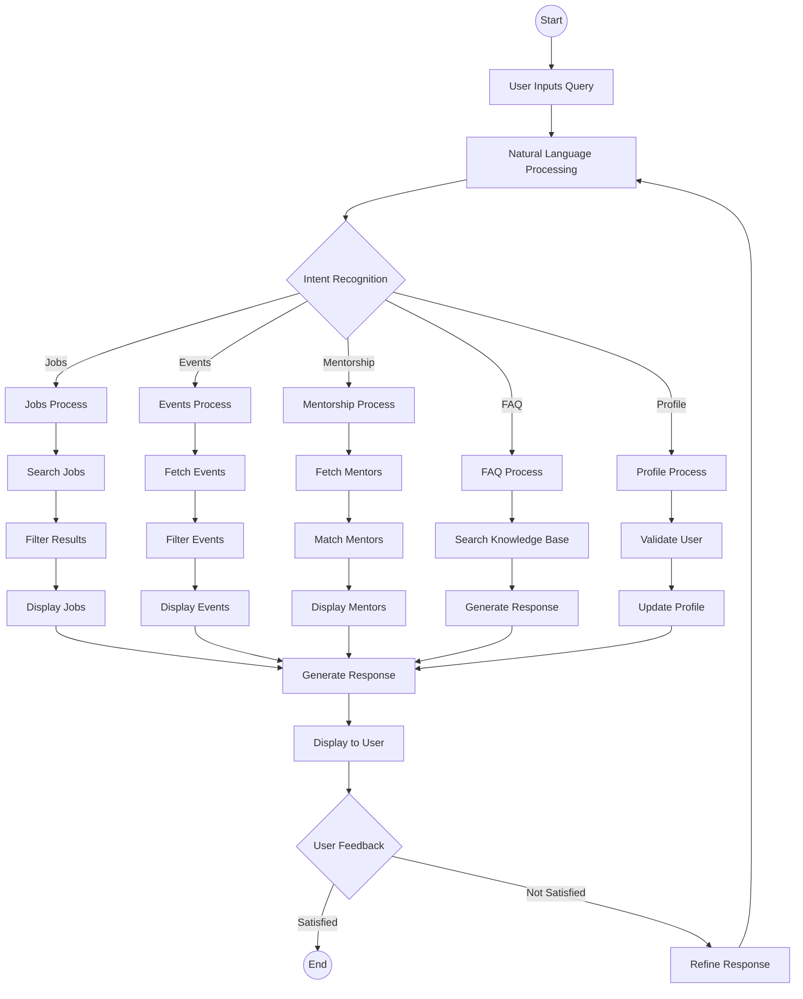
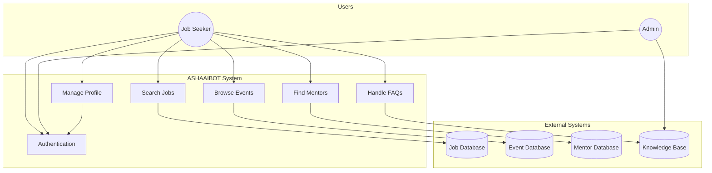

# ASHAAIBOT Process Flow and Use-Case Diagrams

## Process Flow Diagram

## Use-Case Diagram

## Key Process Flows

### 1. Job Search Process
- User inputs job-related query
- System processes natural language input
- Searches job database with relevant filters
- Returns matched job listings
- Handles user feedback and refinement

### 2. Event Discovery Process
- User requests event information
- System categorizes event type
- Filters based on user preferences
- Presents relevant events
- Handles registration queries

### 3. Mentorship Matching Process
- User requests mentorship
- System analyzes user profile
- Matches with available mentors
- Presents mentor profiles
- Facilitates connection process

### 4. FAQ Handling Process
- User asks question
- System categorizes query
- Searches knowledge base
- Generates contextual response
- Learns from user feedback

### 5. Profile Management Process
- User requests profile update
- System validates user
- Processes update request
- Confirms changes
- Updates related systems

## Interaction Points

### User Interactions
- Natural language queries
- Profile updates
- Feedback submission
- Search refinement
- Response rating

### System Responses
- Job recommendations
- Event suggestions
- Mentor matches
- FAQ answers
- Profile confirmations

### Data Management
- Query processing
- Response generation
- User data handling
- Session management
- Feedback processing 