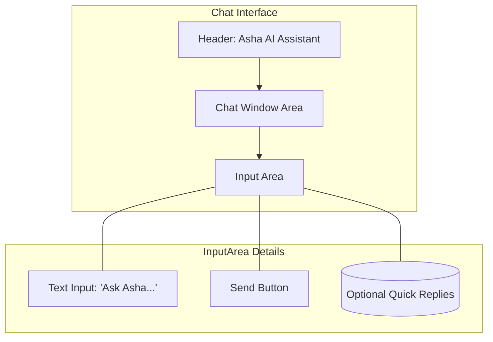
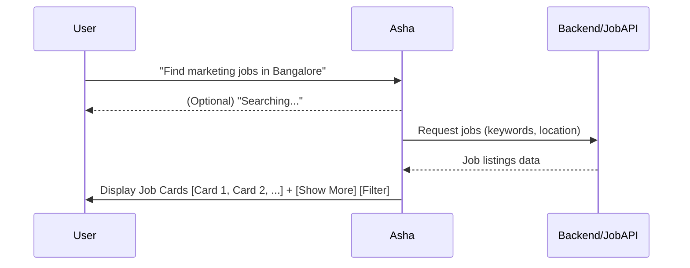
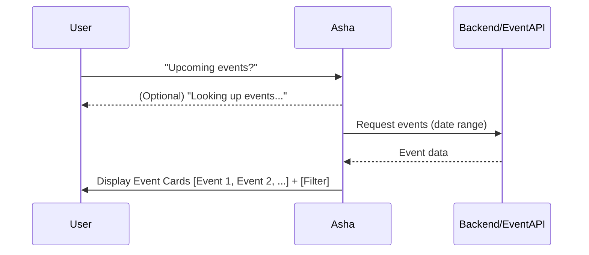
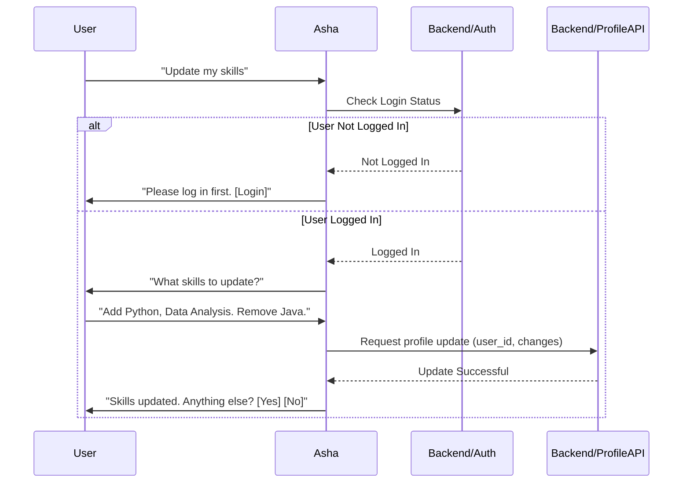

# ASHAAIBOT Wireframes & Mockups

This document describes the conceptual wireframes and mockups for the key user interface elements and flows of the ASHAAIBOT solution. These represent the basic structure and interaction, not the final visual design.

---

## 1. Main Chat Interface Wireframe

*   **Layout:** Standard chat interface layout.
    *   **Header:** 
        *   Title: `Asha AI Assistant` (or similar)
        *   (Optional) Small JobsForHer Logo
    *   **Chat Window (Main Area):** Displays conversation history.
        *   User messages: Aligned right.
        *   Asha's messages: Aligned left, with a small bot icon.
        *   Content: Text, Buttons, Interactive Cards.
    *   **Input Area (Bottom):**
        *   Text Input Field: Placeholder `Ask Asha...`
        *   Send Button: Icon (e.g., paper plane).
        *   (Optional) Quick Reply Buttons: `[Find Jobs] [Upcoming Events] [My Profile]`

*   **Initial State Example:**
    *   **Asha:** "Hi! I'm Asha, your AI assistant for JobsForHer. How can I help you today? You can ask me about jobs, events, mentorship, or manage your profile."
    *   Input area ready for user input.

---

## 2. Job Search Flow Mockup

1.  **User:** Enters query like "Find marketing jobs in Bangalore" or clicks `[Find Jobs]` quick reply.
2.  **(Optional) Asha:** Displays a subtle indicator like "Searching for jobs..."
3.  **Asha:** Displays results as interactive cards or a list.
    *   **Job Card Structure:**
        *   `Job Title`
        *   `Company Name`
        *   `Location`
        *   `Brief Snippet/Description...`
        *   Buttons: `[View Details] [Save Job]`
    *   **Pagination/Refinement:** If many results, show first few (e.g., 3) + buttons: `[Show More Jobs] [Filter Results]`.
    *   **No Results:** "I couldn't find jobs matching your criteria. Try broadening your search?"

---

## 3. Event Discovery Flow Mockup

1.  **User:** Enters query like "What events are happening next week?" or clicks `[Upcoming Events]`.
2.  **(Optional) Asha:** "Looking up events..."
3.  **Asha:** Displays results as cards or a list.
    *   **Event Card Structure:**
        *   `Event Title`
        *   `Date & Time`
        *   `Location/Platform (Online/Offline)`
        *   `Brief Description...`
        *   Button: `[Learn More / Register]`
    *   **Filtering:** May include buttons like `[Filter by Topic] [Filter by Date]`.

---

## 4. Profile Update Flow Mockup (Simple Example)

1.  **User:** Initiates profile update (e.g., "Update my skills" or navigates via buttons).
2.  **Asha (Checks Auth):** Determines if the user is logged in.
    *   **If Not Logged In:** "To update your profile, please log in first. `[Login]`"
    *   **If Logged In:** "Okay, what skills would you like to add or update?"
3.  **User:** Provides details: "Add Python, Data Analysis. Remove Java."
4.  **Asha (Sends to Backend):** Sends update request to backend.
5.  **Asha (Confirmation):** "Got it. I've updated your skills to include Python and Data Analysis, and removed Java. Is there anything else? `[Yes] [No]`"

---

*Note: These are conceptual flows. The final UI will incorporate specific branding and design elements of the JobsForHer Foundation.* 